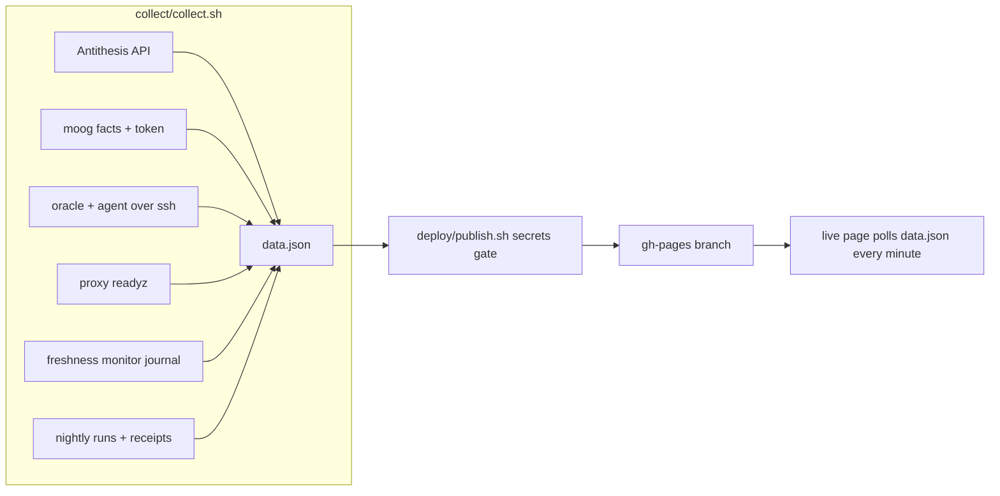

# moog-antithesis-dashboard

Live status page for the moog Antithesis test pipeline of
`cardano-foundation/cardano-node-antithesis`.

Live page: https://lambdasistemi.github.io/moog-antithesis-dashboard/

## Who this is for

- **Someone checking the pipeline** opens the live page and sees, in one
  screen, whether test requests are flowing, the oracle and agent are up,
  Antithesis runs are progressing, on-chain runs are settling, the proxy is
  ready, and the freshness monitor is happy. A stale source is labelled
  `stale` instead of blanking the page, and a snapshot older than 25 minutes
  raises a banner that the collector may be stopped.
- **The operator running the collector** installs the systemd timer below,
  then checks the same page. When a source stops refreshing, a banner names
  it and its last success instead of silently showing old numbers.

## How it works

A user systemd timer runs `deploy/cycle.sh` every 10 minutes. Each cycle
collects one snapshot and publishes it.



1. `collect/collect.sh` fetches seven independent sources into one
   `data.json`: Antithesis runs and their properties, on-chain test-run
   facts and pending requests, oracle and agent containers with agent error
   and publication counts, proxy readiness, the freshness monitor's last
   verdict, and nightly Amaru integration runs with their receipts. It also
   writes one detail file per run (`runs/<run_id>.json`) with the run's full
   parameters, every property with its counterexamples, the matching
   on-chain record, and same-day nightly runs.
2. `deploy/publish.sh` runs a secrets gate and force-pushes `site/` plus
   `data.json` and the detail files as a single orphan commit to `gh-pages`.

The page re-reads `data.json` every minute and warns when the snapshot is
older than 25 minutes.

## Caching

- A source that fails keeps its last good value, marked `stale` on the page.
- Properties of completed Antithesis runs, per-run detail files, and receipts
  of concluded nightly runs never change, so they are fetched once and kept
  in `~/.cache/moog-antithesis-dashboard`. Property descriptions repeat
  verbatim across runs, so they publish once in
  `property-descriptions.json` instead of inside every detail file.

## What never leaves the host

- Antithesis report links (they carry access tokens) are dropped.
- Agent logs embed credentials; only counts computed on the agent host leave it.
- The publish step refuses to push anything matching an authenticated link,
  a bearer header, a basic-auth argument, or the Antithesis key itself.
  Continuous integration runs the same gate over the repository.

## Develop

```sh
nix develop
just ci          # full local gate, mirrors continuous integration
just shellcheck  # lint the shell scripts
just format      # format the shell scripts with shfmt
```

Pull-request previews: every PR publishes `site/` with the frozen sample in
`preview-sample/` to the shared preview host and posts the link on the PR,
then checks the served files. The sample is stale by design; the staleness
banner on a preview is expected.

Requirements on the collector host: `jq`, `curl`, `gh` (authenticated), ssh
access to the `oracle` and `agent` hosts, the moog checkout at `/code/moog`,
and the Antithesis key at `~/.secrets/antithesis-api-key`. Paths are
overridable via the environment variables at the top of each script.

## Install the timer

```sh
git clone git@github.com:lambdasistemi/moog-antithesis-dashboard.git /code/moog-antithesis-dashboard
ln -s /code/moog-antithesis-dashboard/systemd/moog-antithesis-dashboard.{service,timer} ~/.config/systemd/user/
systemctl --user daemon-reload
systemctl --user enable --now moog-antithesis-dashboard.timer
```

## Decisions

| Chosen | Rejected | Why |
|---|---|---|
| Publish from the host to the `gh-pages` branch | Pages in workflow mode | The snapshot refreshes every 10 minutes with host-local secrets (Antithesis key, ssh, journals). A workflow build has none of those inputs, so it cannot produce `data.json`. The legacy branch is the deployment mechanism, not documentation hosting. |
| No versioned releases | release-please | There is no installable artifact. The dashboard deploys continuously from the host; a version tag on every change would be noise. |
| No separate documentation site | MkDocs site on Pages | Pages already serves the dashboard itself. This README is the documentation; it carries the stories and the diagram above. |
| One failing source never blanks the page | Fail the whole snapshot on any source error | Each source is independent. The page shows the last good value marked `stale` so one outage stays visible without hiding the rest. |
| Nightly runs match by same day, only for the nightly testnet | An exact receipt-to-run join | Receipts carry no run key and no nightly run ever reached the launch stage, so same-day runs for `testnets/cardano_amaru` are the strongest available signal. Other runs show no nightly section rather than a guessed one. |

## License

Apache License 2.0. See `LICENSE`.
