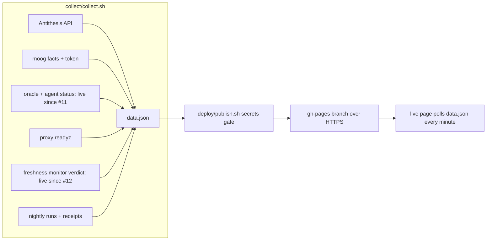

# moog-antithesis-dashboard

Live status page for the moog Antithesis test pipeline of
`cardano-foundation/cardano-node-antithesis`.

Live page: https://lambdasistemi.github.io/moog-antithesis-dashboard/

## Who this is for

- **Someone checking the pipeline** opens the live page and sees, in one
  screen, whether test requests are flowing, the oracle and agent are up,
  Antithesis runs are progressing, on-chain runs are settling, the proxy is
  ready, and the freshness monitor is happy. A stale source is labelled
  `stale` instead of blanking the page, and a snapshot older than 25 minutes
  raises a banner that the collector may be stopped.
- **The operator running the collector** starts one container with
  `docker compose up -d`, then checks the same page. When a source stops
  refreshing, a banner names it and its last success instead of silently
  showing old numbers.

## How it runs

One always-on collector container loops `deploy/cycle.sh` every 10 minutes
(`deploy/loop.sh`, `DASHBOARD_INTERVAL`, default 600). Each cycle collects
one snapshot and publishes it. A failing cycle logs one line and the loop
continues; overlapping cycles are skipped by the existing lock. The
container stops promptly on SIGTERM.



1. `collect/collect.sh` fetches seven independent sources into one
   `data.json`: Antithesis runs and their properties, on-chain test-run
   facts and pending requests, oracle and agent status (live, via their
   status issues), proxy readiness, the freshness monitor verdict (live, via
   its status issue), and nightly Amaru integration runs with their receipts. It
   also writes one detail file per run (`runs/<run_id>.json`), status
   payloads (`status/<reporter>.json`), and the
   shared `property-descriptions.json`.
2. `deploy/publish.sh` runs a secrets gate and force-pushes `site/` plus
   `data.json` and the detail files as a single orphan commit to `gh-pages`
   over HTTPS, authenticating with a push token read from a file.

The page re-reads `data.json` every minute and warns when the snapshot is
older than 25 minutes.

## Secrets

Every secret is a read-only file mounted at `/run/secrets`. Nothing secret
is baked into the image and nothing travels in argv or the environment of
the container itself:

| file | what | who creates it |
|---|---|---|
| `antithesis-key` | Antithesis API read key | the Antithesis tenant admin |
| `gh-read` | GitHub read token, no scopes (public repos only) | the operator, for Actions artifacts, run lists and status issues |
| `pages-push` | fine-grained GitHub token, Contents:write on this repo only | the repository owner, for the `gh-pages` push |
| `moog-read-env` | moog read environment: provider URL and read-only settings only, no wallet paths | the moog operator (a read-only view of the moog setup) |

Put them at `/srv/moog-antithesis-dashboard/` on the collector host, owned
by uid 1000 (the `collector` user the image runs as), mode `0400` (see
`compose.yaml` for the exact mount paths). Inside the
container the Antithesis key travels by stdin pipe to curl, the GitHub
read token lives only in the environment of the single `gh` call that
uses it, and the push token only on a pipe to git's credential helper.
A dry `docker run --rm <image> env` shows no credential.

## One-time setup

1. Create the four secret files above on the collector host.
2. Flip the `moog-antithesis-dashboard` container package to public in
   GHCR (one click in the package settings) so the host pulls the image
   without a credential.
3. Provide the moog binaries read-only at `/opt/moog` on the host.
4. `docker compose up -d`.

## Caching

- A source that fails keeps its last good value, marked `stale` on the page.
- Properties of completed Antithesis runs, per-run detail files, and receipts
  of concluded nightly runs never change, so they are fetched once and kept
  in the `dashboard-cache` volume (`/cache` in the container).
- If the cache volume is lost, every source loses its last good value and
  shows `error` until its first success — never a silently stale number.
- Property descriptions repeat verbatim across runs, so they publish once in
  `property-descriptions.json` instead of inside every detail file.

## Status reporters (oracle, agent, monitor)

One tiny container runs on each of the oracle and agent hosts and edits
one status issue on this repository every 5 minutes. It lists containers
through the Docker socket with curl, keeps names matching `moog` (name,
image without the registry prefix, status), and PATCHes the payload as the
issue body over HTTPS. The oracle sends `{role, containers, reported_at}`
(UTC, ISO 8601); the agent adds `errors_6h` and `published_24h`. The token
lives in a file and reaches curl through its stdin config, never argv; on
failure the old body stays and the reporter logs one line and retries.

On the agent, the two counts come from the first container whose name
matches `moog-agent`, read through `GET /containers/<id>/logs` over the
same socket: lines matching `exception|error` (case-insensitive) over the
last 6 hours, and lines matching `Published result` over the last 24
hours. The log stream is demultiplexed in memory and counted line by
line; no raw log ever leaves the host — only the two integers travel in
the payload. If no moog-agent container exists or the logs call fails,
the reporter exits non-zero and the previous body stays.

A host clock more than 15 minutes behind shows stale even while reporting:
`last_success` is the payload's `reported_at`, and anything older than 15
minutes counts as failed. (More than 2 minutes ahead is refused outright.)
Keep host clocks in sync.

```sh
# On either host: check the payload without sending anything.
REPORTER_ROLE=agent REPORT_DRY_RUN=1 ./reporter/report.sh
# Collector side: check what would publish without pushing or needing a token.
DASHBOARD_DRY_RUN=1 ./deploy/publish.sh
```

The reporter needs one fine-grained token per host (Issues: write on this
repo only, nothing else): the oracle and agent tokens live in
`/srv/moog-status-reporter/status-token` on their hosts, and the third one
belongs to the freshness-monitor host, mode `0400` everywhere, with the
issue number in `STATUS_ISSUE_NUMBER` (see `reporter/compose.yaml` for the
socket mount and the Docker group GID). When a token expires, that card
turns stale with its last success time; nothing else breaks. Rotate yearly
at most (maximum token lifetime).

The freshness monitor is not a container here: the monitor's own script
calls the same reporter image one-shot, verdict line on stdin, token file
bind-mounted read-only:

```sh
echo "OK run_id=$id age=${age}s maximum=${max}s" | docker run --rm -i \
  -v /srv/moog-status-reporter/status-token:/run/secrets/status-token:ro \
  -e STATUS_ISSUE_NUMBER=3 \
  ghcr.io/lambdasistemi/moog-antithesis-dashboard-reporter:main \
  /app/reporter/push-verdict.sh
# Dry run first: prints the payload, needs no token, sends nothing.
echo "OK run_id=$id age=${age}s maximum=${max}s" | REPORT_DRY_RUN=1 \
  ./reporter/push-verdict.sh
```

Rejected: ssh pulls (the collector has no ssh client by design), a
receiver service (a new always-on endpoint to patch for the same outcome),
gists (no fine-grained scope), pushing a git branch (the token could write
gh-pages), on-chain facts (barred: the dashboard never writes chain data).

## What never leaves the collector

- Antithesis report links (they carry access tokens) are dropped before
  publication.
- The publish step refuses to push anything matching an authenticated
  link, a bearer header, a basic-auth argument, the Antithesis key, any
  mounted secret file, or any long value of the moog read environment.
  Continuous integration runs the same gate over fixtures.

## Develop

```sh
nix develop
just ci          # full local gate, mirrors continuous integration
just shellcheck  # lint the shell scripts
just format      # format the shell scripts with shfmt
```

Pull-request previews: every PR publishes `site/` with the frozen sample in
`preview-sample/` to the shared preview host and posts the link on the PR,
then checks the served files. The sample is stale by design; the staleness
banner on a preview is expected.

Collector requirements live in `compose.yaml`: the image, the four secret
files, the read-only moog directory, and the cache volume. Script paths
stay overridable via the environment variables at the top of each script.

## Decisions

| Chosen | Rejected | Why |
|---|---|---|
| One loop container (`loop.sh` + `cycle.sh`, restart `unless-stopped`) | systemd timer | The collector is one always-on container on one host; a unit plus a timer plus a lock is three moving parts doing the job of one loop. The loop logs a failing cycle and continues, and stops promptly on SIGTERM. |
| Publish from the host to the `gh-pages` branch | Pages in workflow mode | The snapshot refreshes every 10 minutes with secrets mounted as files into the collector container (Antithesis key, GitHub tokens, moog read environment). A workflow build has none of those inputs, so it cannot produce `data.json`. The legacy branch is the deployment mechanism, not documentation hosting. |
| HTTPS push with a file-read credential helper | SSH deploy keys and agent sockets | One Contents-write token in a mounted file, handed to git on a pipe only for the push. No key material in the image, no agent socket crossing into the container. |
| Status via per-reporter issue edits (#11, #12) | Always-on receiver endpoint | No listening service to supervise and patch; each reporter token can only edit its own status issue. See `docs/transport-design.md`. |
| No versioned releases | release-please | There is no installable artifact. The dashboard deploys continuously from the collector container; a version tag on every change would be noise. |
| No separate documentation site | MkDocs site on Pages | Pages already serves the dashboard itself. This README is the documentation; it carries the stories and the diagram above. |
| One failing source never blanks the page | Fail the whole snapshot on any source error | Each source is independent. The page shows the last good value marked `stale` so one outage stays visible without hiding the rest. |
| Nightly runs match by same day, only for the nightly testnet | An exact receipt-to-run join | Receipts carry no run key and no nightly run ever reached the launch stage, so same-day runs for `testnets/cardano_amaru` are the strongest available signal. Other runs show no nightly section rather than a guessed one. |

## License

Apache License 2.0. See `LICENSE`.
